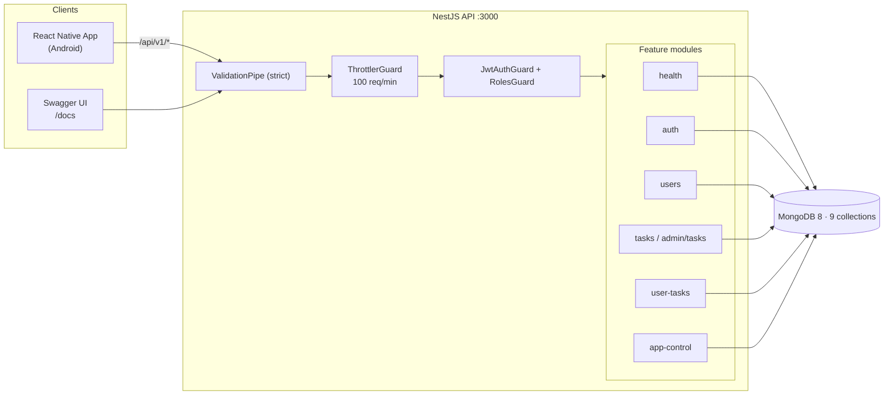
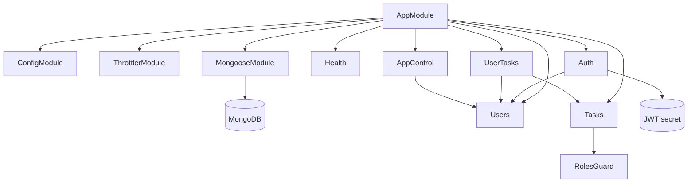
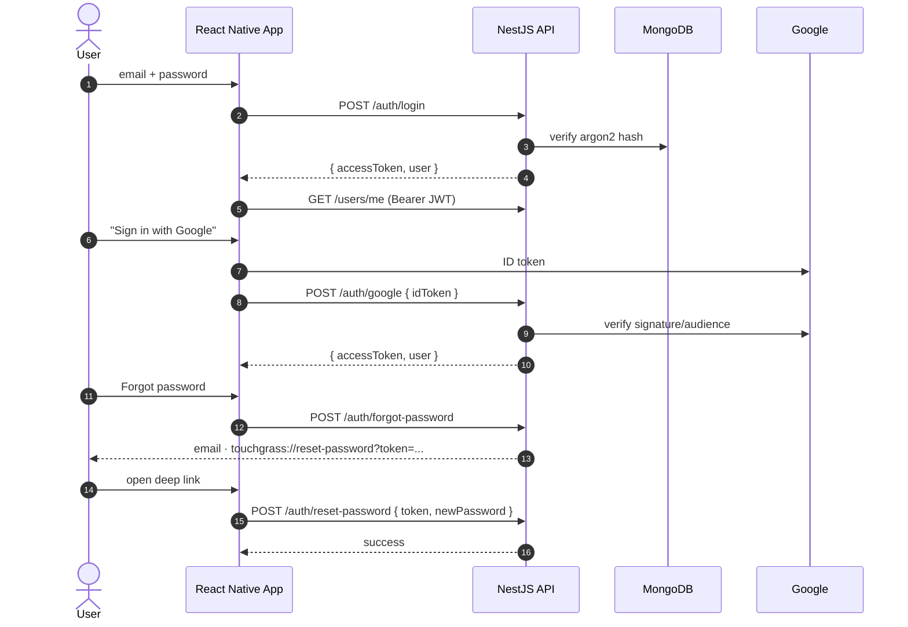

# Touch Grass Mobile — Backend API

Backend for the **CSE430 course project "Touch Grass"**: an Android app that blocks social-media
apps until the user completes real-world tasks (walking, photo verification, screen-off timers)
and earns XP/Leaf Points that unlock limited app access. This repo serves the NestJS API that the
React Native frontend talks to.

## Tech stack

- **NestJS 11** + TypeScript (Node.js ≥ 22.11)
- **Mongoose 9** / **MongoDB 8** (see `compose.yaml`)
- **JWT** auth with **argon2** password hashing; Google sign-in (ID-token verification); password-reset email via nodemailer
- **Swagger** (`@nestjs/swagger`) UI at `/docs`
- Joi-validated environment, global `ValidationPipe` (strict), global `ThrottlerGuard` (100 req/min)

## System architecture



## Prerequisites

- Node.js ≥ 22.11
- Docker (to run MongoDB via `compose.yaml`) or an existing MongoDB instance
- An `.env` file (see below) — the app refuses to boot without the required vars

## Setup

```bash
npm install
copy .env.example .env    # Windows
# or: cp .env.example .env  (Linux/macOS)
docker compose up -d      # start MongoDB 8
npm run seed:tasks        # populate the task catalog
```

### Environment variables

Required (validated by Joi in `src/app.module.ts`):

| Variable                | Description                                                  |
| ----------------------- | ------------------------------------------------------------ |
| `MONGODB_URI`           | MongoDB connection string (`mongodb://` or `mongodb+srv://`) |
| `JWT_ACCESS_SECRET`     | Secret used to sign access tokens                            |
| `JWT_ACCESS_EXPIRES_IN` | Access-token lifetime, e.g. `15m`                            |

Optional:

| Variable                                                                                           | Description                                                                                                     |
| -------------------------------------------------------------------------------------------------- | --------------------------------------------------------------------------------------------------------------- |
| `PORT`                                                                                             | HTTP port (default `3000`)                                                                                      |
| `PASSWORD_RESET_TTL_MINUTES`                                                                       | Reset-token lifetime, 10–15 (default `15`)                                                                      |
| `PASSWORD_RESET_URL`                                                                               | App deep link used in reset emails (default `touchgrass://reset-password`); required only if `MAIL_HOST` is set |
| `MAIL_HOST` / `MAIL_PORT` / `MAIL_SECURE` / `MAIL_USER` / `MAIL_PASSWORD` / `MAIL_FROM`            | SMTP settings for reset emails (Mailtrap/Ethereal/other); reset email is silently skipped when unset            |
| `GOOGLE_ANDROID_CLIENT_ID` / `GOOGLE_WEB_CLIENT_ID`                                                | Google sign-in client IDs; Google login 503s if both are unset                                                  |
| `APPLE_TEAM_ID` / `APPLE_KEY_ID` / `APPLE_SERVICE_ID` / `APPLE_PRIVATE_KEY` / `APPLE_REDIRECT_URI` | Unused placeholders — Apple login is not implemented                                                            |

## Running

```bash
npm run start        # run dist/main (build first with npm run build)
npm run start:dev    # watch mode
npm run start:prod   # run dist/main (production entry)
```

- API base URL: `http://localhost:3000/api/v1` (when `PORT=3000`)
- Swagger UI: `http://localhost:3000/docs`

## Testing

Run in this order:

```bash
npm run lint      # eslint + prettier (runs with --fix; rewrites files)
npm run build     # nest build — the typecheck
npm test          # unit tests (*.spec.ts in src/)
npm run test:cov  # unit tests with coverage report -> coverage/
npm run test:e2e  # e2e tests against a LIVE MongoDB (docker + .env required)
```

E2E specs boot the real `AppModule` and register/clean up their own users; they re-apply the global
prefix + `ValidationPipe` from `main.ts` manually, so keep them in lockstep with `main.ts`.

## API overview

All routes are under the `/api/v1` prefix and return JSON; only `GET /`, `GET /health` and the
`/auth/*` endpoints are public, everything else needs a JWT bearer token (admin routes need
`role: 'admin'`). **46 endpoints across 8 controllers** (audited — see
`Documentation/ProgressReport/2_backend_endpoints.md`).

| Area        | Base path             | Endpoints | Purpose                                                                               |
| ----------- | --------------------- | --------- | ------------------------------------------------------------------------------------- |
| App         | `/api/v1/`            | 1         | Root hello                                                                            |
| Health      | `/api/v1/health`      | 1         | Liveness check                                                                        |
| Auth        | `/api/v1/auth`        | 5         | Register, login, Google login, forgot/reset password                                  |
| Users       | `/api/v1/users`       | 2         | Get/update own profile                                                                |
| Tasks       | `/api/v1/tasks`       | 2         | List active task catalog                                                              |
| Admin tasks | `/api/v1/admin/tasks` | 5         | Full task CRUD; delete = soft deactivate                                              |
| User tasks  | `/api/v1/user-tasks`  | 16        | Accept, progress, GPS/screen-timer/manual-checkin/photo sessions, statistics, rewards |
| App control | `/api/v1/app-control` | 14        | Blocking rules, allowlist, LP unlocks, usage stats                                    |

The full per-endpoint catalog (method, auth, request/response, notes) is in the Swagger UI at
`/docs` and in `Documentation/ProgressReport/2_backend_endpoints.md`.

### Module dependencies

Actual imports from the module files (`src/*/*.module.ts`):



## Authentication flows



## Project structure

```
src/
  app.module.ts          # root module: ConfigModule (Joi), ThrottlerModule, MongooseModule
  main.ts                # bootstrap: /api/v1 prefix, ValidationPipe, Swagger
  health/                # liveness endpoint
  auth/                  # JWT + argon2 auth, Google login, reset-password flows
  users/                 # profile
  tasks/                 # public task catalog + admin task CRUD (soft delete)
  user-tasks/            # accepted tasks, typed verification sessions, rewards
  app-control/           # rules, allowlist, unlocks, usage summaries
  seeds/                 # task-seed data + seeder (npm run seed:tasks)
test/                    # e2e specs (*.e2e-spec.ts)
```

## Key conventions

- UI-facing messages, API responses and Swagger summaries are **Vietnamese** — keep them that way.
- Task cycles (daily/weekly) are computed in **Asia/Ho_Chi_Minh** time.
- Admin task deletion is a **soft deactivate** (`active: false`).
- `POST /app-control/unlock` requires an **`Idempotency-Key`** header; client-supplied price fields
  are rejected; protected packages (social media) return **403**.
- `MONGO_ROOT_USERNAME` / `MONGO_ROOT_PASSWORD` / `MONGO_DATABASE` in `.env` feed `compose.yaml`.
