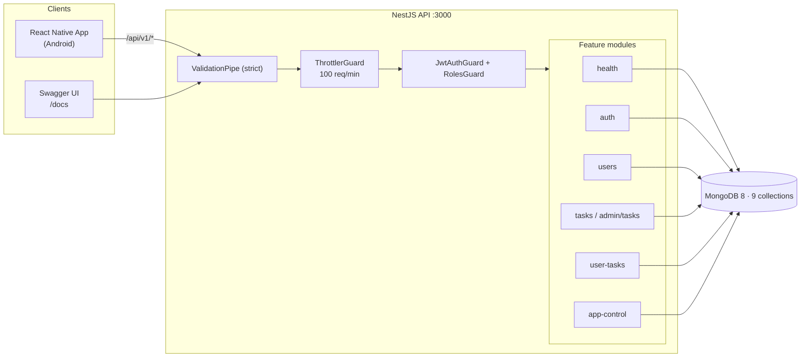
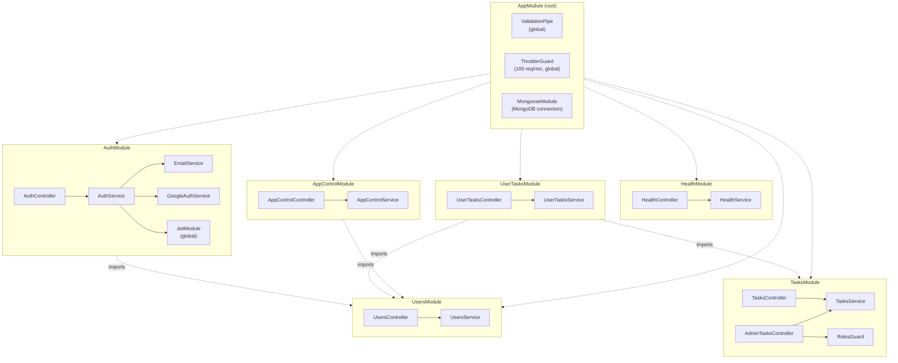
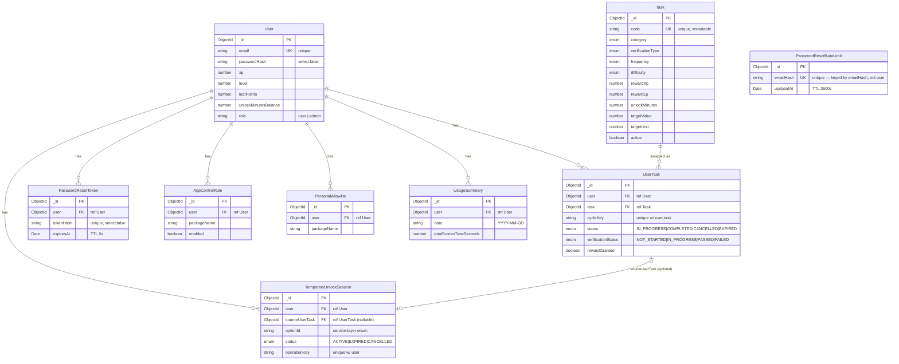
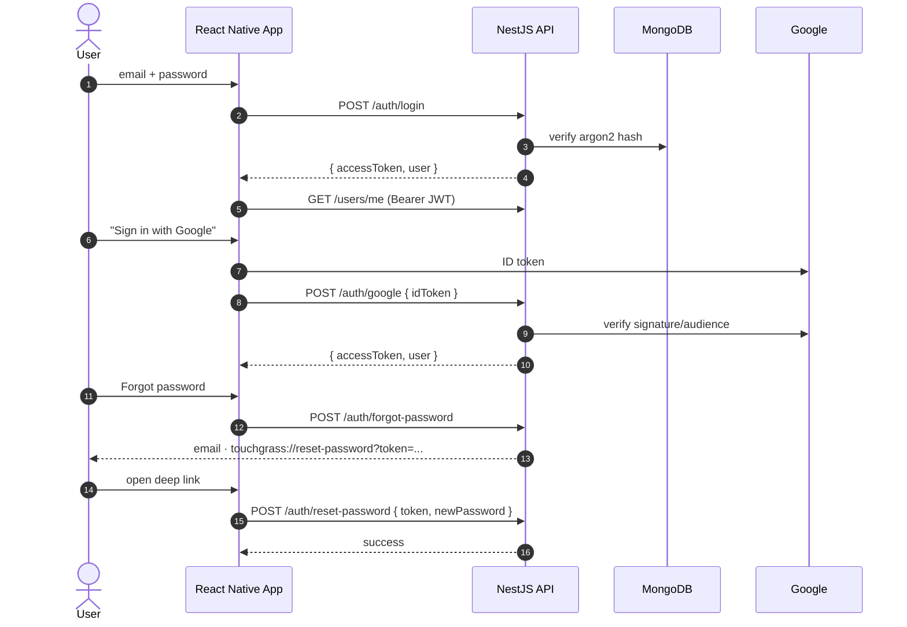

# Touch Grass Mobile (Backend API)
Frontend Repo is here: https://github.com/huyvu26/TouchGrass

This repo is backend for the **CSE430 course project "Touch Grass"**: an Android app that blocks social-media
apps until the user completes real-world tasks (walking, photo verification, screen-off timers)
and earns XP/Leaf Points that unlock limited app access. This repo serves the NestJS API that the
React Native frontend talks to.

## Tech stack

- **NestJS 11** + TypeScript (Node.js ≥ 22.11)
- **Mongoose 9** / **MongoDB 8** (see `compose.yaml`)
- **JWT** auth with **argon2** password hashing; Google sign-in (ID-token verification); password-reset email via nodemailer
- **Swagger** (`@nestjs/swagger`) UI at `/docs`
- Joi-validated environment, global `ValidationPipe` (strict), global `ThrottlerGuard` (100 req/min)

## Project structure

```
src/
  app.module.ts          # root module: ConfigModule (Joi), ThrottlerModule, MongooseModule
  main.ts                # bootstrap: /api/v1 prefix, ValidationPipe, Swagger
  health/                # liveness endpoint
  auth/                  # JWT + argon2 auth, Google login, reset-password flows
  users/                 # profile
  tasks/                 # public task catalog + admin task CRUD (soft delete)
  user-tasks/            # accepted tasks, typed verification sessions, rewards
  app-control/           # rules, allowlist, unlocks, usage summaries
  seeds/                 # task-seed data + seeder (npm run seed:tasks)
test/                    # e2e specs (*.e2e-spec.ts)
```

## System architecture



## Prerequisites

- Node.js ≥ 22.11
- Docker (to run MongoDB via `compose.yaml`) or an existing MongoDB instance
- An `.env` file (see below) — the app refuses to boot without the required vars

## Setup

```bash
npm install
copy .env.example .env    # Windows
# or: cp .env.example .env  (Linux/macOS)
docker compose up -d      # start MongoDB 8
npm run seed:tasks        # populate the task catalog
```

### Environment variables

Required (validated by Joi in `src/app.module.ts`):

| Variable                | Description                                                  |
| ----------------------- | ------------------------------------------------------------ |
| `MONGODB_URI`           | MongoDB connection string (`mongodb://` or `mongodb+srv://`) |
| `JWT_ACCESS_SECRET`     | Secret used to sign access tokens                            |
| `JWT_ACCESS_EXPIRES_IN` | Access-token lifetime, e.g. `15m`                            |

Optional:

| Variable                                                                                           | Description                                                                                                     |
| -------------------------------------------------------------------------------------------------- | --------------------------------------------------------------------------------------------------------------- |
| `PORT`                                                                                             | HTTP port (default `3000`)                                                                                      |
| `PASSWORD_RESET_TTL_MINUTES`                                                                       | Reset-token lifetime, 10–15 (default `15`)                                                                      |
| `PASSWORD_RESET_URL`                                                                               | App deep link used in reset emails (default `touchgrass://reset-password`); required only if `MAIL_HOST` is set |
| `MAIL_HOST` / `MAIL_PORT` / `MAIL_SECURE` / `MAIL_USER` / `MAIL_PASSWORD` / `MAIL_FROM`            | SMTP settings for reset emails (Mailtrap/Ethereal/other); reset email is silently skipped when unset            |
| `GOOGLE_ANDROID_CLIENT_ID` / `GOOGLE_WEB_CLIENT_ID`                                                | Google sign-in client IDs; Google login 503s if both are unset                                                  |
| `APPLE_TEAM_ID` / `APPLE_KEY_ID` / `APPLE_SERVICE_ID` / `APPLE_PRIVATE_KEY` / `APPLE_REDIRECT_URI` | Unused placeholders — Apple login is not implemented                                                            |

## Running

```bash
npm run start        # run dist/main (build first with npm run build)
npm run start:dev    # watch mode
npm run start:prod   # run dist/main (production entry)
```

- API base URL: `http://localhost:3000/api/v1` (when `PORT=3000`)
- Swagger UI: `http://localhost:3000/docs`

## Testing

Run in this order:

```bash
npm run lint      # eslint + prettier (runs with --fix; rewrites files)
npm run build     # nest build — the typecheck
npm test          # unit tests (*.spec.ts in src/)
npm run test:cov  # unit tests with coverage report -> coverage/
npm run test:e2e  # e2e tests against a LIVE MongoDB (docker + .env required)
```

E2E specs boot the real `AppModule` and register/clean up their own users; they re-apply the global
prefix + `ValidationPipe` from `main.ts` manually, so keep them in lockstep with `main.ts`.

## API overview

All routes are under the `/api/v1` prefix and return JSON; only `GET /`, `GET /health` and the
`/auth/*` endpoints are public, everything else needs a JWT bearer token (admin routes need
`role: 'admin'`). **46 endpoints across 8 controllers** (audited — see
`Documentation/ProgressReport/2_backend_endpoints.md`).

| Area        | Base path             | Endpoints | Purpose                                                                               |
| ----------- | --------------------- | --------- | ------------------------------------------------------------------------------------- |
| App         | `/api/v1/`            | 1         | Root hello                                                                            |
| Health      | `/api/v1/health`      | 1         | Liveness check                                                                        |
| Auth        | `/api/v1/auth`        | 5         | Register, login, Google login, forgot/reset password                                  |
| Users       | `/api/v1/users`       | 2         | Get/update own profile                                                                |
| Tasks       | `/api/v1/tasks`       | 2         | List active task catalog                                                              |
| Admin tasks | `/api/v1/admin/tasks` | 5         | Full task CRUD; delete = soft deactivate                                              |
| User tasks  | `/api/v1/user-tasks`  | 16        | Accept, progress, GPS/screen-timer/manual-checkin/photo sessions, statistics, rewards |
| App control | `/api/v1/app-control` | 14        | Blocking rules, allowlist, LP unlocks, usage stats                                    |

The full per-endpoint catalog (method, auth, request/response, notes) is in the Swagger UI at
`/docs` and in `Documentation/ProgressReport/2_backend_endpoints.md`.

### Use Case Diagram

```mermaid
flowchart LR
    subgraph Actors
        NewUser["👤 New User"]
        ExistingUser["👤 Existing User"]
        User["👤 User"]
        Android["📱 Native Android Services"]
        NewUser --|> User
        ExistingUser --|> User
    end

    subgraph System["Touch Grass App"]
        UC01["Register"]
        UC02["Login"]
        UC03["Accept Task"]
        UC04["GPS Task"]
        UC05["Photo Task"]
        UC06["Screen-Off Task"]
        UC07["Check-In Task"]
        UC08["Claim Reward"]
        UC09["App Blocking"]
        UC10["Unlock Time"]
    end

    User --> UC03 & UC04 & UC05 & UC06 & UC07 & UC08 & UC09 & UC10
    NewUser --> UC01
    ExistingUser --> UC02
    Android --> UC04 & UC06 & UC09 & UC10

    UC03 --> UC04 & UC05 & UC06 & UC07
    UC04 & UC05 & UC06 & UC07 --> UC08
    UC08 --> UC10
```

The system focuses on ten core interactions, with four task types (GPS, photo, screen-off, check-in) feeding into a unified reward system and optional app-unlock mechanism.

### Module dependencies

Actual imports from the module files (`src/*/*.module.ts`)
The backend is a NestJS 11 application organized into one root module and six feature modules: HealthModule, UsersModule, AuthModule, TasksModule, UserTasksModule, and AppControlModule. Each module owns a distinct part of the domain and its own Mongoose models, and shares functionality with other modules only through explicit exports, such as UsersModule exporting UsersService. Dependencies flow in one direction: AuthModule, UserTasksModule, and AppControlModule depend on UsersModule, and UserTasksModule additionally depends on TasksModule. Every module follows the same layered structure — controller, then service, then Mongoose model — with no separate repository layer. Cross-cutting concerns are handled once at the application root: a global validation pipe checks all request bodies, a global throttling guard limits requests to 100 per minute, and each controller requiring authentication applies a JwtAuthGuard at the class or method level. An additional role guard restricts the five admin task-management routes to administrator accounts.



> **Notes:**
> - Dotted lines (`-.->`) represent module imports; solid lines (`-->`) represent intra-module dependencies.
> - `AppModule` also applies the global `ValidationPipe`, `ThrottlerGuard`, `/api/v1` prefix, and `MongooseModule` connection.
> - `RolesGuard` + `@Roles('admin')` protects `/admin/tasks/*` only.

### Data Model

The database contains nine MongoDB collections, distributed across the users, tasks, user-tasks, auth, and app-control modules, with each collection managed exclusively by its owning module. Relationships between collections are implemented as object references rather than database-level foreign keys, so integrity is enforced in the service layer instead of by MongoDB itself. User is the central entity, referenced by most other collections, while UserTask also references Task and is optionally linked from a temporary unlock session when an unlock was earned by completing a task. One collection, the password-reset rate limit, is keyed by a hashed email address instead of a user reference, which allows the system to rate-limit reset requests even for accounts that do not exist. Several collections use unique compound indexes to prevent duplicate or conflicting records — for example, a user cannot accept the same task twice in one cycle, and repeated unlock requests with the same idempotency key are treated as one operation. Two collections also use expiring indexes so that password-reset tokens and rate-limit records are removed automatically once they are no longer needed.



> **Notes:**
> - `PasswordResetRateLimit` is keyed by `emailHash`, not `user` — supports rate-limiting on unregistered emails.
> - `UserTask` has a compound unique index on `{user, task, cycleKey}`.
> - `AppControlRule`, `PersonalAllowlist`, and `UsageSummary` each have compound unique indexes on their user + natural key.
> - `TemporaryUnlockSession.operationKey` is unique per user (compound index).

## Authentication flows



## 3.7 Sequence Diagrams

### D4 — Register → Permission → Home

```mermaid
sequenceDiagram
    autonumber
    actor User

    box rgb(242, 245, 238) Frontend (React Native)
        participant RegisterScreen
        participant RNAuthService as authService (RN)
        participant ApiClient
        participant AuthContext
        participant AuthStorage as authStorage (AsyncStorage)
        participant PermissionScreen
        participant NativeModules as Native modules (usageStats / deviceSettings / accessibilityMonitor)
        participant HomeScreen
    end

    box rgb(238, 245, 232) Backend (NestJS)
        participant AuthController
        participant BackendAuthService as AuthService
        participant UsersService
        participant JwtGuard as JwtAuthGuard
        participant UsersController
    end

    participant MongoDB

    rect rgb(240, 248, 240)
        Note over User,RegisterScreen: Register
        User ->> RegisterScreen: fill form, tap "Tạo tài khoản"
        RegisterScreen ->> RegisterScreen: validateForm()\n(fullName≥3, email regex,\npassword≥8, confirm match)

        alt client validation fails
            RegisterScreen -->> User: inline field errors (no request sent)
        else client validation passes
            RegisterScreen ->> RNAuthService: register({fullName, email, password})
            RNAuthService ->> ApiClient: POST /auth/register (authenticated:false)
            ApiClient ->> AuthController: POST /api/v1/auth/register\n[global ValidationPipe: whitelist, forbidNonWhitelisted, transform]
            AuthController ->> BackendAuthService: register(registerDto)
            BackendAuthService ->> UsersService: findByEmail(email)
            UsersService ->> MongoDB: findOne({email})
            MongoDB -->> UsersService: user | null
            UsersService -->> BackendAuthService: existingUser?

            alt email already exists
                BackendAuthService -->> AuthController: throw ConflictException "Email already exists"
                AuthController -->> ApiClient: 409 Conflict
                ApiClient -->> RNAuthService: ApiError(409, message)
                RNAuthService -->> RegisterScreen: throws
                RegisterScreen -->> User: Alert "Đăng ký thất bại"
            else email is free
                BackendAuthService ->> BackendAuthService: argon2.hash(password, argon2id)
                BackendAuthService ->> UsersService: createUser({fullName, email, passwordHash})
                UsersService ->> MongoDB: insert User document
                MongoDB -->> UsersService: createdUser
                UsersService -->> BackendAuthService: createdUser
                BackendAuthService ->> BackendAuthService: createAuthResponse(user)\nsignAsync({sub: user._id, role})
                BackendAuthService -->> AuthController: { accessToken, user }
                AuthController -->> ApiClient: 201 Created { accessToken, user }
                ApiClient -->> RNAuthService: { accessToken, user }
                RNAuthService -->> RegisterScreen: authResponse

                RegisterScreen ->> AuthStorage: saveAccessToken(accessToken)
                RegisterScreen ->> AuthContext: setUser(authResponse.user)
                RegisterScreen -->> User: Alert "Tạo tài khoản thành công" (button "Tiếp tục")

                rect rgb(230, 245, 230)
                    Note over User,PermissionScreen: Permission
                    User ->> RegisterScreen: tap "Tiếp tục"
                    RegisterScreen ->> PermissionScreen: navigation.reset(['Permission'])

                    PermissionScreen ->> NativeModules: request Camera permission
                    PermissionScreen ->> NativeModules: deviceSettings.getFineLocationPermissionStatus()
                    PermissionScreen ->> NativeModules: usageStatsService (Usage Access / AppOps)
                    PermissionScreen ->> NativeModules: accessibilityMonitor.isAccessibilityEnabled()
                    NativeModules -->> PermissionScreen: permission statuses

                    User ->> PermissionScreen: grant the 4 permissions
                    PermissionScreen ->> AuthStorage: markOnboardingComplete()
                    PermissionScreen ->> HomeScreen: continueToHome() navigation.reset(['Home'])
                end

                rect rgb(235, 245, 235)
                    Note over User,HomeScreen: Home dashboard load
                    HomeScreen ->> HomeScreen: useFocusEffect(() => loadDashboard())

                    par getMyProfile()
                        HomeScreen ->> ApiClient: GET /users/me (Authorization: Bearer <token>)
                        ApiClient ->> JwtGuard: verify JWT
                        JwtGuard -->> UsersController: request.user = { sub, role }
                        UsersController ->> UsersService: findById(sub)
                        UsersService ->> MongoDB: findById(sub)
                        MongoDB -->> UsersService: user
                        UsersService -->> UsersController: user
                        UsersController -->> ApiClient: 200 { profile }
                        ApiClient -->> HomeScreen: profile
                    else getTaskSummary() / getUserTasks(1,20)
                        HomeScreen ->> ApiClient: GET /user-tasks/summary + GET /user-tasks
                        ApiClient -->> HomeScreen: taskSummary, userTasks
                    else local app-control state
                        HomeScreen ->> NativeModules: isAppControlEnabled()
                        HomeScreen ->> AuthStorage: getAppLimitRules()
                        NativeModules -->> HomeScreen: controlEnabled
                        AuthStorage -->> HomeScreen: appRules
                    end

                    HomeScreen -->> User: render profile, XP/LP, active-task CTA, app-control card
                end
            end
        end
    end
```

D4 explains how a brand-new user gets from signing up to a working Home screen.

RegisterScreen validates the form locally, then calls POST /auth/register. The backend checks for a duplicate email, hashes the password with argon2, creates the user in MongoDB, and returns a signed JWT plus the profile. The client stores the token, updates its auth state, and shows a success alert.

Tapping "Tiếp tục" moves the user to PermissionScreen, which requests the four permissions the app needs (Camera, location, Usage Access, Accessibility) through the native bridge. Once granted, it marks onboarding complete and navigates to Home.

HomeScreen then loads its dashboard by firing off the profile, task-summary, and app-control requests in parallel, so the whole flow ends with a fully populated Home screen rather than a blank one.

### D5 — GPS Task Lifecycle

```mermaid
sequenceDiagram
    autonumber
    actor User
    participant RN as GPSTrackerScreen (React Native)
    participant Reward as RewardScreen (React Native)
    participant Ctrl as UserTasksController /api/v1/user-tasks
    participant Svc as UserTasksService
    participant Users as UsersService
    participant DB as MongoDB (user_tasks)

    Note over RN: TaskDetailScreen already called<br/>POST /user-tasks {taskId} → status = IN_PROGRESS<br/>navigated here with {userTaskId}

    rect rgb(240, 248, 240)
        Note over User,DB: Start GPS verification session
        User ->> RN: screen mounts (beginTracking)
        RN ->> RN: request ACCESS_FINE_LOCATION + ensure location services on
        RN ->> Ctrl: POST /user-tasks/:id/gps/start
        activate Ctrl
        Ctrl ->> Svc: startGpsTracking(userId, userTaskId)
        activate Svc
        Svc ->> DB: findOne(userTask)
        DB -->> Svc: userTask

        alt task.verificationType != GPS_DISTANCE
            Svc -->> Ctrl: 400 BadRequestException
        else verificationStatus == PASSED (already verified earlier)
            Svc -->> Ctrl: gpsResponse(alreadyProcessed = true)
        else verificationStatus == IN_PROGRESS with trackingStartedAt set
            Note right of Svc: idempotent resume – same session, no reset
            Svc -->> Ctrl: gpsResponse(alreadyProcessed = true)
        else NOT_STARTED / FAILED (fresh or retried session)
            Svc ->> DB: findOneAndUpdate(guard: status=IN_PROGRESS AND<br/>verificationStatus in {unset, NOT_STARTED, FAILED})<br/>SET verificationStatus=IN_PROGRESS, trackingStartedAt=now,<br/>distance/duration/speed/sampleCount=0, INC verificationAttempts
            DB -->> Svc: startedUserTask (or null if raced)
            opt update returned null (race)
                Svc ->> DB: re-fetch latest
                Svc -->> Ctrl: gpsResponse(alreadyProcessed = true)<br/>or 409 "Could not start GPS tracking"
            end
            Svc -->> Ctrl: gpsResponse(alreadyProcessed = false)
        end
        deactivate Svc
        Ctrl -->> RN: 200 {trackingStartedAt, targetValue, verificationStatus}
        deactivate Ctrl
    end

    RN ->> RN: setPhase('tracking') startLocationWatch()

    rect rgb(245, 248, 240)
        Note over User,DB: Client-side collection (no network calls)
        loop every GPS fix (watchPosition, distanceFilter 3m, up to 500 points)
            RN ->> RN: recordPosition(fix)
            Note right of RN: keep only if accuracy ≤ 50m<br/>AND timestamp strictly increasing<br/>vs. the last kept point
        end
    end

    rect rgb(240, 245, 250)
        Note over User,DB: Finish & server-side verification
        User ->> RN: tap "Kết thúc và xác minh"
        RN ->> RN: guard: points.length ≥ 2 (else alert, stay tracking)
        RN ->> Ctrl: POST /user-tasks/:id/gps/finish {points: GpsPoint[2..500]}
        activate Ctrl
        Ctrl ->> Svc: finishGpsTracking(userId, userTaskId, dto)
        activate Svc
        Svc ->> DB: findOne(userTask)
        DB -->> Svc: userTask

        alt verificationStatus == PASSED already
            Svc -->> Ctrl: gpsResponse(alreadyProcessed = true)
        else status != IN_PROGRESS OR verificationStatus != IN_PROGRESS<br/>OR trackingStartedAt missing
            Svc -->> Ctrl: 409 ConflictException "GPS tracking has not been started"
        else session is live — run calculateGpsSummary(points, trackingStartedAt)
            Svc ->> Svc: filter points where accuracy ≤ 50m
            alt accuratePoints.length < 2
                Svc -->> Ctrl: 400 "At least two accurate GPS points are required"
            else timestamps not strictly increasing
                Svc -->> Ctrl: 400 "GPS point timestamps must be strictly increasing"
            else timestamps outside ±2min clock tolerance of<br/>trackingStartedAt / now
                Svc -->> Ctrl: 400 "GPS point timestamps are outside the tracking session"
            else duration ≤ 0 or > 4h (client or server-measured)
                Svc -->> Ctrl: 400 "Invalid GPS tracking duration"
            else all checks pass
                loop each consecutive point pair
                    Svc ->> Svc: segmentDistance = Haversine(p[i-1], p[i])
                    Note right of Svc: skip segment if segmentDistance ≤<br/>max(2m, accuracyNoise × 0.15)<br/>(GPS noise floor)
                    Svc ->> Svc: segmentSpeedKmh = segmentDistance / segmentSeconds × 3.6
                    alt segmentSpeedKmh > 15 km/h
                        Svc ->> Svc: hasUnrealisticSpeed = true
                    else within walking speed
                        Svc ->> Svc: distanceMeters += segmentDistance
                    end
                end

                alt hasUnrealisticSpeed == true
                    Svc ->> Svc: passed = false, failureReason = "UNREALISTIC_SPEED"
                else distanceMeters ≥ task.targetValue
                    Svc ->> Svc: passed = true, failureReason = null
                else distanceMeters < task.targetValue
                    Svc ->> Svc: passed = false, failureReason = "TARGET_NOT_REACHED"
                end

                Svc ->> DB: findOneAndUpdate(guard: status=IN_PROGRESS AND<br/>verificationStatus=IN_PROGRESS)<br/>SET verificationStatus=PASSED|FAILED, progress,<br/>distanceMeters, durationSeconds, averageSpeedKmh,<br/>verifiedAt, trackingEndedAt, failureReason
                DB -->> Svc: finishedUserTask (or null if raced)

                alt update returned null (state changed mid-request)
                    Svc ->> DB: re-fetch latest
                    alt latest.verificationStatus != IN_PROGRESS
                        Svc -->> Ctrl: gpsResponse(alreadyProcessed = true)
                    else
                        Svc -->> Ctrl: 409 "GPS tracking state changed while finishing"
                    end
                else
                    Svc -->> Ctrl: gpsResponse(passed, failureReason,<br/>summary, alreadyProcessed = false)
                end
            end
        end
        deactivate Svc
        Ctrl -->> RN: 200 {verificationStatus, passed, summary, failureReason}
        deactivate Ctrl
    end

    alt verificationStatus == PASSED
        RN ->> RN: setPhase('passed')
        RN ->> RN: completeAndOpenReward() [auto-chained]
    else verificationStatus == FAILED
        RN -->> User: show failure message (UNREALISTIC_SPEED / TARGET_NOT_REACHED), setPhase('failed')
        User ->> RN: tap "Thử lại GPS"
        RN ->> Ctrl: POST /user-tasks/:id/gps/start (retry)
        Note right of Ctrl: verificationStatus=FAILED is an<br/>allowed restart state (see first alt above)
    end

    rect rgb(240, 240, 250)
        Note over User,DB: Task completion
        RN ->> Ctrl: POST /user-tasks/:id/complete
        activate Ctrl
        Ctrl ->> Svc: completeTask(userId, userTaskId)
        activate Svc
        Svc ->> DB: findOne(userTask) + task lookup
        alt currentUserTask.status == COMPLETED already
            Svc -->> Ctrl: cached response (idempotent re-call)
        else status != IN_PROGRESS
            Svc -->> Ctrl: 409 "Only an in-progress task can be completed"
        else task.verificationType == GPS_DISTANCE AND<br/>verificationStatus != PASSED
            Svc -->> Ctrl: 409 "GPS task must pass verification before completion"
        else progress < task.targetValue
            Svc -->> Ctrl: 400 "Task target has not been reached"
        else all guards pass
            Svc ->> DB: findOneAndUpdate(guard: status=IN_PROGRESS AND<br/>progress ≥ targetValue)<br/>SET status=COMPLETED, completedAt=now
            DB -->> Svc: completedUserTask
            Svc -->> Ctrl: {userTask, task,<br/>rewardPreview:{xp, leafPoints, unlockMinutes:0}}
        end
        deactivate Svc
        Ctrl -->> RN: 200
        deactivate Ctrl
        RN ->> Reward: navigation.replace('Reward', {userTaskId})
    end

    rect rgb(250, 245, 240)
        Note over User,DB: Claim reward (idempotent)
        User ->> Reward: screen mounts
        Reward ->> Ctrl: POST /user-tasks/:id/claim-reward
        activate Ctrl
        Ctrl ->> Svc: claimReward(userId, userTaskId)
        activate Svc
        Svc ->> DB: findOne(userTask)
        alt status != COMPLETED
            Svc -->> Ctrl: 409 "Task must be completed before claiming reward"
        else status == COMPLETED
            Svc ->> Svc: task = findById(userTask.task)
            alt userTask.rewardGranted == false (first claim)
                Svc ->> Users: grantTaskReward(userId, userTaskId,<br/>task.rewardXp, task.rewardLp)
                activate Users
                Users ->> Users: atomically credit xp += rewardXp,<br/>leafPoints += rewardLp;<br/>recalculate level = floor(xp/100)+1
                Users -->> Svc: updated user
                deactivate Users
                Svc ->> DB: updateOne(guard: rewardGranted=false)<br/>SET rewardGranted=true
                Note right of Svc: idempotency guard: the filter on<br/>rewardGranted=false makes a concurrent<br/>double-claim a no-op on the 2nd writer
            else rewardGranted == true already
                Svc ->> Svc: alreadyClaimed = true (no credit issued again)
            end
            Svc -->> Ctrl: {reward:{xp, leafPoints, unlockMinutes:0},<br/>profile:{xp, level, leafPoints, unlockMinutesBalance},<br/>alreadyClaimed}
        end
        deactivate Svc
        Ctrl -->> Reward: 200
        deactivate Ctrl
        Reward ->> User: show reward popup (XP bar fill, LP balance update)
    end
```

The GPS task flow follows one task from tracking start to reward payout.

POST /gps/start checks if the task is already tracking or verified, so it's safe to retry. While tracking, GPS points are loosely filtered on the client, but the server re-checks everything independently.

POST /gps/finish does the real work: it re-filters points for accuracy, measures distance with the Haversine formula while ignoring GPS jitter, and checks the speed between points stays under 15 km/h — the app's only anti-cheat signal. Too fast fails as "unrealistic speed"; too short fails as "target not reached."

POST /complete just confirms verification passed, letting the app show a "verified but not claimed" state. POST /claim-reward uses a simple flag to stop XP and Leaf Points being credited twice. One gap: the response always returns unlockMinutes: 0, so GPS tasks don't actually credit unlock minutes yet.

### D6 — Photo Verify Flow

Trace Summary

Photos are labeled on-device by ML Kit before upload; if no labels are found, nothing is sent to the server.

The photo, its labels, and a capture timestamp are uploaded to the backend, which runs several checks before accepting it: file size and format (verified from the file itself, not the client's claim), capture time (rejecting stale or future-dated photos), task state, and photo reuse (resubmitting the same photo is a harmless retry; reusing it on a different task is rejected as cheating). Only then are the labels matched against what the task requires.

A guarded database write ensures two simultaneous submissions of the same photo can't both count toward progress.

On the client: a pass completes the task; a partial accept means more photos are needed; anything else shows the rejection reason with a retry option.

[D6: Photo Verify Flow — PlantUML]

```mermaid
sequenceDiagram
    autonumber
    actor User
    participant Camera as AICameraScreen
    participant MLKit as ML Kit (on-device)
    participant Analysis as AIAnalysisScreen
    participant Api as userTaskService (apiClient)
    participant Ctrl as UserTasksController
    participant Multer as FileInterceptor (multer, memory)
    participant Svc as UserTasksService
    participant DB as MongoDB UserTask

    rect rgb(240, 248, 240)
        Note over User,DB: Capture & on-device labeling
        User ->> Camera: tap shutter
        Camera ->> Camera: capturePhotoToFile()\n(local file, JPEG, capturedAt = now())
        Camera ->> MLKit: label(imageUri)
        MLKit -->> Camera: labels[] {text, confidence}

        alt no labels detected
            Camera -->> User: Alert "Chưa nhận diện được ảnh" (capture discarded, nothing sent)
        else labels found
            Camera ->> Analysis: navigate('AIAnalysis', {userTaskId, imageUri, capturedAt, labels})

            rect rgb(238, 245, 238)
                Note over User,DB: Submit for server-side verification
                Analysis ->> Api: verifyUserTaskPhoto(userTaskId, imageUri, labels, capturedAt)
                Api ->> Ctrl: POST /user-tasks/:id/photo/verify (multipart: image, labels=JSON, capturedAt)
                Ctrl ->> Multer: parse multipart (limits: 1 file, ≤5MB)
                Multer -->> Ctrl: image.buffer
                Ctrl ->> Svc: verifyPhoto(userId, userTaskId, dto, image)
            end

            rect rgb(250, 245, 240)
                Note over User,DB: Anti-cheat: structural checks
                alt userTaskId is not a valid ObjectId
                    Svc -->> Ctrl: 400 "Invalid user task id"
                else image missing (stripped by multer / not sent)
                    Svc -->> Ctrl: 400 "Image file is required"
                else size outside [1 KB, 5 MB]
                    Svc -->> Ctrl: 400 "Image size must be between 1 KB and 5 MB"
                else all structural checks pass
                    Svc ->> Svc: detectImageMimeType(buffer)\n(byte sniff, ignores client Content-Type:\nFFD8FF=JPEG, 89504E47...=PNG, RIFF..WEBP=WebP)
                    alt no known signature matched
                        Svc -->> Ctrl: 400 "Only JPEG, PNG, or WebP images are allowed"
                    else MIME type valid
                        rect rgb(245, 248, 245)
                            Note over User,DB: Anti-cheat: freshness / clock-skew check
                            Svc ->> Svc: compare capturedAt vs server now()\n(tolerance +2 min future, max age 5 min)
                            alt capturedAt too far in the future OR older than 5 min
                                Svc -->> Ctrl: 400 "Photo must be captured within the last 5 minutes"
                            else timestamp valid
                                Svc ->> DB: findOne(UserTask{_id, user}) + submittedPhotoHashes
                                DB -->> Svc: currentUserTask | null
                                alt currentUserTask not found
                                    Svc -->> Ctrl: 404 "User task not found"
                                else currentUserTask.status != IN_PROGRESS
                                    Svc -->> Ctrl: 409 "Only an in-progress task can verify a photo"
                                else task and status OK
                                    Svc ->> Svc: load Task by currentUserTask.task
                                    alt task.verificationType != PHOTO_AI
                                        Svc -->> Ctrl: 400 "Task does not use photo verification"
                                    else task.verificationLabels is empty (misconfigured task)
                                        Svc -->> Ctrl: 500 "Photo verification labels are not configured for this task"
                                    else task config OK
                                        alt verificationStatus already PASSED
                                            Svc -->> Ctrl: 200 (idempotent) passed=true, alreadyProcessed=true
                                        else not yet passed
                                            alt capturedAt < startedAt - tolerance
                                                Svc -->> Ctrl: 400 "Photo was captured before the task was started"
                                            else timestamp after task start
                                                rect rgb(250, 250, 240)
                                                    Note over User,DB: Anti-cheat: duplicate-photo detection
                                                    Svc ->> Svc: photoHash = sha256(image.buffer)
                                                    alt hash already in THIS task's submittedPhotoHashes
                                                        Svc -->> Ctrl: 200 (idempotent) alreadyProcessed=true, photoAccepted=false
                                                    else new hash for this task
                                                        Svc ->> DB: findOne(UserTask{user, _id != this, submittedPhotoHashes: hash})
                                                        DB -->> Svc: reusedPhoto | null
                                                        alt reusedPhoto found (same photo reused on a different task)
                                                            Svc -->> Ctrl: 409 "This photo has already been submitted for another task"
                                                        else photo is unique across tasks
                                                            rect rgb(240, 245, 250)
                                                                Note over User,DB: Anti-cheat: ML Kit label match
                                                                Svc ->> Svc: match submitDto.labels against task.verificationLabels<br/>@ verificationMinConfidence (default 0.7)
                                                                alt no accepted label OR confidence < minimum
                                                                    Svc ->> DB: findOneAndUpdate(guard: status=IN_PROGRESS, hash not-in set)<br/>SET verificationStatus=FAILED, +1 attempt, addToSet(hash)
                                                                    DB -->> Svc: updated doc | null (concurrent write)
                                                                    alt update returned null
                                                                        Svc ->> DB: re-fetch latest UserTask
                                                                        alt hash now present (concurrent duplicate request)
                                                                            Svc -->> Ctrl: 200 idempotent duplicate result
                                                                        else
                                                                            Svc -->> Ctrl: 409 "Photo verification state changed while processing"
                                                                        end
                                                                    else update applied
                                                                        Svc -->> Ctrl: 200 rejected<br/>failureReason = LABEL_NOT_ACCEPTED | LOW_CONFIDENCE
                                                                    end
                                                                else label accepted at/above confidence threshold
                                                                    Svc ->> DB: findOneAndUpdate(guard: status/progress/hash unchanged)<br/>SET progress = min(progress+1, targetValue),<br/>PASSED if target reached, else IN_PROGRESS
                                                                    DB -->> Svc: updated doc | null (concurrent write)
                                                                    alt update returned null
                                                                        Svc ->> DB: re-fetch latest UserTask
                                                                        alt hash now present (concurrent duplicate request)
                                                                            Svc -->> Ctrl: 200 idempotent duplicate result
                                                                        else
                                                                            Svc -->> Ctrl: 409 "Photo verification state changed while processing"
                                                                        end
                                                                    else update applied
                                                                        Svc -->> Ctrl: 200 accepted<br/>progress updated, passed = (progress ≥ targetValue)
                                                                    end
                                                                end
                                                            end
                                                        end
                                                    end
                                                end
                                            end
                                        end
                                    end
                                end
                            end
                        end
                    end
                end
            end

            Ctrl -->> Api: JSON PhotoVerificationResponse
            Api -->> Analysis: PhotoVerificationResponse

            rect rgb(240, 240, 250)
                Note over User,DB: Client-side result handling
                alt result.passed == true
                    Analysis ->> Api: completeUserTask(userTaskId)
                    Api ->> Ctrl: POST /user-tasks/:id/complete
                    Analysis ->> Analysis: navigation.replace('Reward', {userTaskId})
                else photoAccepted == true (multi-photo task, target not yet reached)
                    Analysis -->> User: "Ảnh đã được chấp nhận" + "Chụp ảnh tiếp theo" → back to Camera
                else rejected (LABEL_NOT_ACCEPTED / LOW_CONFIDENCE / duplicate)
                    Analysis -->> User: show failureReason + "Chụp lại" → back to Camera
                end
            end
        end
    end
```



### D7 — App Block → Task → Unlock
```mermaid
sequenceDiagram
    autonumber
    actor User
    participant A11y as AppMonitorAccessibilityService (native, polling 1s)
    participant Policy as AppControlPolicy (native, pure logic)
    participant Prefs as SharedPreferences (touch_grass_app_control)
    participant Overlay as Lock Overlay / AppLockActivity
    participant RN as MainActivity / RN App
    participant TaskFlow as TaskDetail / Verification screens
    participant Reward as RewardScreen
    participant Ctrl as AppControlController
    participant Svc as AppControlService
    participant Mongo as MongoDB (rules, unlock sessions)

    rect rgb(240, 248, 240)
        Note over User,Mongo: Detection (fully local, no network)
        loop every 1s or on window-state change
            A11y ->> A11y: read currentForegroundPackage
            A11y ->> Policy: evaluate(context, packageName)
            Policy ->> Prefs: read enabled flag,<br/>unlock_until_&lt;pkg&gt;, rules JSON
            Policy ->> Policy: isProtected? / schedule active? /<br/>getTodayUsageMinutes()
            Policy -->> A11y: Decision(shouldLock, appName,<br/>usedMinutes, limitMinutes)
        end

        alt shouldLock == true
            A11y ->> Prefs: save KEY_PENDING_PACKAGE,<br/>KEY_PENDING_APP_NAME
            A11y ->> Overlay: show TYPE_ACCESSIBILITY_OVERLAY<br/>(or launch AppLockActivity on failure)
            Overlay ->> User: "Đã đạt giới hạn" + 3 buttons

            User ->> Overlay: tap "Mở Touch Grass để làm nhiệm vụ"
            Overlay ->> RN: launch MainActivity<br/>(FLAG_ACTIVITY_NEW_TASK | CLEAR_TOP)

            rect rgb(238, 245, 238)
                Note over User,Mongo: Task completion (RN ↔ Backend, JWT)
                RN ->> TaskFlow: navigate TaskHub → TaskDetail
                TaskFlow ->> TaskFlow: verification session<br/>(gps/photo/screen-timer/manual)
                TaskFlow ->> TaskFlow: POST /user-tasks/:id/complete
                TaskFlow ->> Reward: POST /user-tasks/:id/claim-reward<br/>(rewardXp, rewardLp, unlockMinutes)
            end

            rect rgb(250, 245, 240)
                Note over User,Mongo: Unlock purchase
                Reward ->> Reward: getPendingLockedApp()<br/>(from native prefs via bridge)
                Reward ->> Ctrl: POST /app-control/unlock<br/>Header Idempotency-Key: reward-{userTaskId}-{pkg}<br/>Body {packageName, optionId}
                Ctrl ->> Svc: createUnlock(userId, dto, operationKey)

                Svc ->> Svc: validate Idempotency-Key<br/>assertNotProtected(packageName)<br/>assertNotAllowlisted(userId, packageName)
                Svc ->> Mongo: findOne rule {user, packageName, enabled:true}
                alt no enabled rule
                    Mongo -->> Svc: null
                    Svc -->> Ctrl: 404 NotFoundException
                    Ctrl -->> Reward: 404
                else rule found
                    Mongo -->> Svc: rule
                    Svc ->> Mongo: findOne unlock session<br/>by operationKey (idempotency check)
                    alt session already exists (retry)
                        Mongo -->> Svc: existing session
                        Svc ->> Svc: assertSameUnlock(session, pkg, optionId)
                        Svc ->> Svc: ensureDebited() — already debited, skip charge
                    else new unlock
                        Svc ->> Mongo: findOne active session for package<br/>(status=ACTIVE, expiresAt>now, debited=true)
                        Mongo -->> Svc: currentActiveSession or null
                        Svc ->> Svc: extensionBase = currentActiveSession.expiresAt ?? now
                        Svc ->> Mongo: create TemporaryUnlockSession<br/>{expiresAt = extensionBase + option.minutes,<br/>optionId, leafPointsSpent, debited:false}
                        Svc ->> Svc: ensureDebited()<br/>→ usersService.spendLeafPoints(userId, cost, operationKey)
                        alt insufficient Leaf Points
                            Svc ->> Mongo: deleteOne session (debited:false)
                            Svc -->> Ctrl: 400 BadRequestException "Insufficient Leaf Points"
                            Ctrl -->> Reward: 400
                        else LP spent OK
                            Svc ->> Mongo: session.debited = true; save()
                        end
                    end
                    Svc -->> Ctrl: {expiresAt, remainingLeafPoints,<br/>minutes, alreadyProcessed}
                    Ctrl -->> Reward: 201 UnlockResponseDto
                end
            end

            rect rgb(240, 240, 250)
                Note over User,Mongo: Persist unlock natively
                Reward ->> RN: native call<br/>AppControl.setTemporaryUnlockUntil(packageName, expiresAt)
                RN ->> Policy: setTemporaryUnlockUntil(context, pkg, expiresAtMs)
                Policy ->> Prefs: write unlock_until_&lt;pkg&gt; = expiresAtMs<br/>remove KEY_PENDING_PACKAGE / KEY_PENDING_APP_NAME
                Reward ->> RN: navigate back to Home
            end

            rect rgb(245, 245, 240)
                Note over User,Mongo: Next detection cycle
                A11y ->> Policy: evaluate(context, packageName)
                Policy ->> Prefs: unlock_until_&lt;pkg&gt; > now?
                Policy -->> A11y: Decision(shouldLock = false)
                A11y ->> Overlay: hideLockOverlay()
            end
        end
    end
```
Blocking, task completion, and the unlock flow were traced across app-control.controller.ts, app-control.service.ts, AppMonitorAccessibilityService.kt, AppLockActivity.kt, and AppControlPolicy.kt.

AppMonitorAccessibilityService polls the foreground app each second and checks AppControlPolicy.evaluate(), which runs fully on-device via SharedPreferences and UsageStatsManager. If locking is required, an overlay (or AppLockActivity fallback) is shown.

From there, the user opens Touch Grass, completes a task, and claims the reward. RewardScreen calls POST /app-control/unlock with an Idempotency-Key; the backend validates the package, then creates or reuses an unlock session and debits Leaf Points, rejecting the request on insufficient balance.

The client stores the returned expiresAt locally, so later checks return shouldLock = false. Detection runs offline, but pricing and debits are enforced only on the server.

## Key conventions

- UI-facing messages, API responses and Swagger summaries are **Vietnamese** — keep them that way.
- Task cycles (daily/weekly) are computed in **Asia/Ho_Chi_Minh** time.
- Admin task deletion is a **soft deactivate** (`active: false`).
- `POST /app-control/unlock` requires an **`Idempotency-Key`** header; client-supplied price fields
  are rejected; protected packages (social media) return **403**.
- `MONGO_ROOT_USERNAME` / `MONGO_ROOT_PASSWORD` / `MONGO_DATABASE` in `.env` feed `compose.yaml`.
